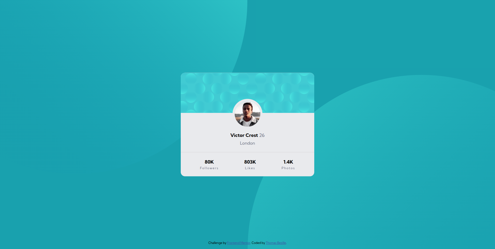
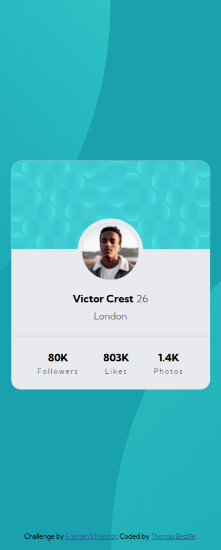

# Profile card component

> Le challenge Profile Card Component de Frontend Mentor est un exercice pratique qui consiste à créer une carte de profil élégante et responsive. Une excellente occasion de perfectionner ses bases en HTML5, CSS3 et de s'entraîner à reproduire un design fidèlement.

**🔗 [Demo en ligne](https://front-end-mentor-profile-card-compo.vercel.app/)**

---

## 🎯 Objectif

Ce challenge a été réalisé dans le cadre de ma progression en développement frontend. Il consiste à reproduire fidèlement une carte de profil élégante et responsive à partir d'un design fourni par Frontend Mentor. Ce projet a été réalisé avec HTML5 et SASS afin de consolider mes bases en intégration web.

**Les compétences pour ce challenge :**

- Structure sémantique HTML5 (`<article>`, `<header>`, `<address>`)
- Utilisation de SASS
- Positionnement CSS (`position: relative`, `position: absolute`)
- Gestion des images circulaires (`border-radius: 50%`)
- Centrage d'éléments avec Flexbox (`align-items`, `justify-content`)
- Ajout d'une image de fond avec `background-image`
- Gestion des `background-size` et `background-position`
- Typographie (`font-size`, `font-weight`, `line-height`, `letter-spacing`)
- Responsive design et approche mobile-first
- Gestion des couleurs avec les variables SASS
- Débogage et test sur différentes résolutions avec les DevTools

---

## 🛠️ Stack

---

## 👤 Contact

**Thomas Bezille** — Développeur web à Nantes

